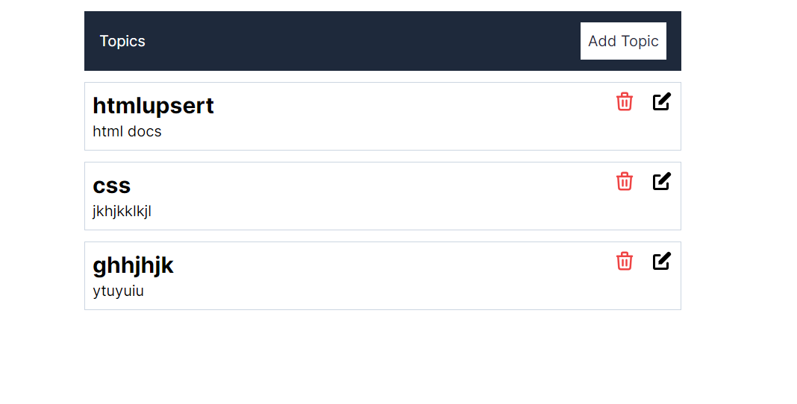

This is a [Next.js](https://nextjs.org/) project bootstrapped with [`create-next-app`](https://github.com/vercel/next.js/tree/canary/packages/create-next-app).

## Getting Started

First, run the development server:

```bash
npm run dev
```
## Features
It is a  CRUD Full stack app with nextjs 14 app router and for backend api router is used.

* Add a topic
* Update a topic
* Delete a topic



# Stack
* Nextjs
* Tailwind css
* Mongoose ORM for Mongodb
* Typescript

